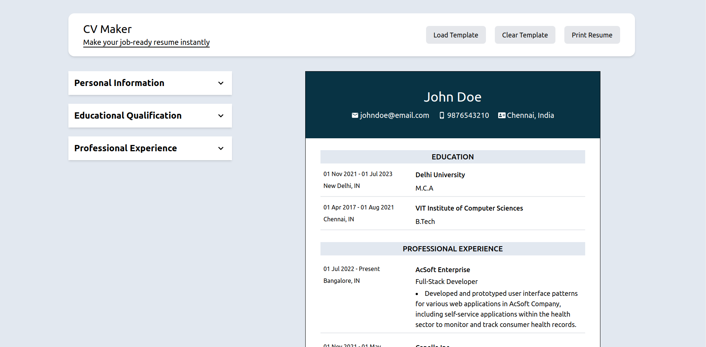

# CV Maker - React + Vite Project

CV Maker is a mobile-friendly web application that allows users to create job-ready resumes instantly. Users can load a template, enter their personal information, educational qualifications, and professional experience to generate a professional resume. This project served me well as a great starting point for practicing React concepts, as it involved structuring the application into components and managing state using props. This project was part of Odin Project's [assignment](https://www.theodinproject.com/lessons/node-path-react-new-cv-application).

## Features

For this project, I have implemented the following features:

- **Load Template Button**: Users can load a pre-designed template for their resume.
- **Clear Template Button**: Option to clear the current template and start over.
- **Print Resume Button**: Users can print the generated resume for offline use.
- **Personal Information**: Section to input personal details such as first name, last name, email, phone number, and address.
- **Educational Qualification**: Section to add educational qualifications, including institution name, degree, and dates of study.
- **Professional Experience**: Section to add professional experience, including company name, position, dates of employment, and job responsibilities.

## Deployment

The CV Maker application is deployed and accessible online [here](https://roopxx.github.io/cv-app/).

### Desktop View



### Tab View


### Mobile View


## Skills Learned

- Responsive Design
- Conditional Rendering
- Dynamic Rendering
- State Management
- Controlled Components

## Technologies Used

- HTML
- Tailwind CSS
- JavaScript / JSX
- React

## Installation

To install the project, follow these steps:

```bash
git clone https://github.com/roopxx/cv-app.git
cd cv-app
npm install
npm run dev
```

## Conclusion

Building this CV application has been an exciting journey, allowing me to solidify my understanding of React fundamentals. I look forward to further expanding my skills in future projects. Thank you for checking out my project!

## Contributing

Contributions are welcome! If you find any bugs or have suggestions for improvement, please open an issue or submit a pull request.
